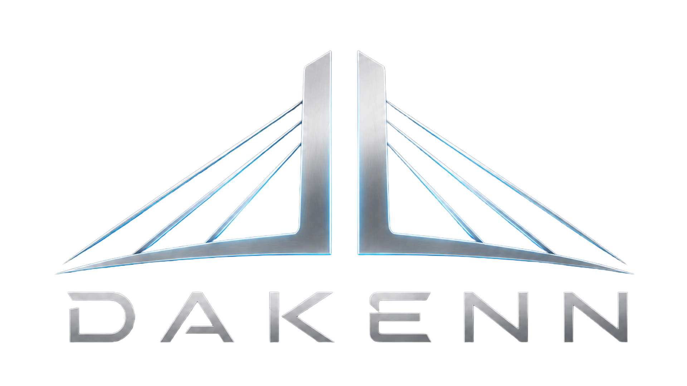
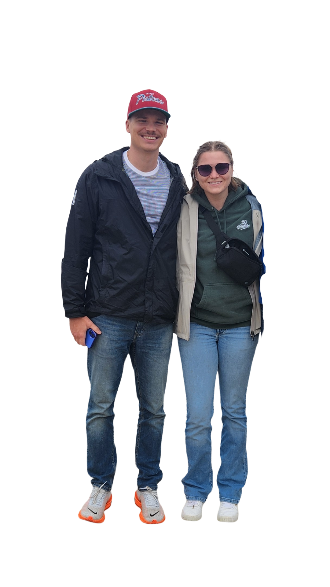

# kkoparka.github.io

<html lang="en">
<head>
<meta charset="UTF-8">
<meta name="viewport" content="width=device-width, initial-scale=1.0">
<title>DAKENN - Game App Create</title>

<link rel="preconnect" href="https://fonts.googleapis.com">
<link rel="preconnect" href="https://fonts.gstatic.com" crossorigin>
<link href="https://fonts.googleapis.com/css2?family=Orbitron:wght@400;600;700&family=Inter:wght@300;400;500;600&display=swap" rel="stylesheet">

<link rel="stylesheet" href="https://cdnjs.cloudflare.com/ajax/libs/font-awesome/6.5.1/css/all.min.css">

</head>
<body>

<!-- HERO -->

<section class="hero">
    

        

        <h1>DAKENN</h1>

        
Game • App • Create

    

</section>

<!-- MISSION -->

<section class="mission">
    

        <h2>We Make Apps We Use Ourselves</h2>

        

            Building useful software, engaging games, and digital experiences
            that solve real problems and bring people together.
        

    

</section>

<!-- ABOUT -->

<section>
    

        

            <h2>Who Are We</h2>

            

                DAKENN is a small independent studio focused on creating
                software and games with purpose. We believe the best products
                come from building solutions we genuinely want to use ourselves.
                Every project is driven by curiosity, craftsmanship, and a
                passion for creating experiences that people enjoy returning to.
            

        

        

            
        

    

</section>

<!-- FOOTER -->

<footer>

    

     

    <a href="mailto:contact@dakenn.com" class="contact-btn">
        Contact Us
    </a>

    

        <a href="https://www.apple.com/app-store/" target="_blank">
            <i class="fa-brands fa-apple"></i>
        </a>

        <a href="https://play.google.com/store" target="_blank">
            <i class="fa-brands fa-google-play"></i>
        </a>

        <a href="https://instagram.com" target="_blank">
            <i class="fa-brands fa-instagram"></i>
        </a>

    

</footer>

</body>
</html>
